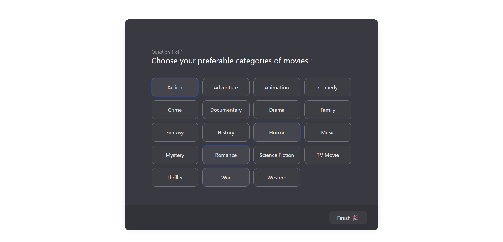

# 🎬 Movie Recommendation by Genre

A responsive movie recommendation interface built with **Tailwind CSS** and **Vanilla JavaScript**.
Users select their favorite movie genres, and the app suggests matching movies using the **TMDB API**.

> 🚧 Project Status: **In Development...

---

## **✅ Page (1/3) :**

---

## **🛠️ Tech Stack**

- **HTML**
- **Tailwind CSS**
- **JavaScript (Vanilla)**

---

## 🎯 Upcoming Goals

### 📄 Page 1: Genre Selection

- ✅ Allow users to select one or more movie genres from a clean, responsive UI.
- ✅ Visually indicate selected genres with toggle behavior (highlight on click).
- 🎯 Store selected genres in memory to be used in the next page.

---

### 📄 Page 2: Movie Suggestions

- 🎯 Use the selected genres to fetch a list of movies from the [TMDB API](https://www.themoviedb.org/documentation/api).
- 🎞️ Display suggested movies in a **slide-style layout** (carousel or horizontal scroll).
- 🧭 Allow navigation between movie cards using intuitive controls or gestures.

---

### 📄 Page 3: Movie Details

- 🎯 When a user clicks on a suggested movie, show a detailed view with:
  - Poster image
  - Title and description
  - Genre(s)
  - Release date
  - Rating
  - 🎬 Optional: Trailer video or link to watch

---

## 🔧 Technical Goals

- 🔗 **Connect to TMDB API** to dynamically fetch real movie data based on selected genres.
- 💅 **Improve mobile UX** through careful spacing, readable font sizes, and responsive layouts using **Tailwind CSS**.
- 🌀 **Add animations** and interactive transitions to make the UI modern and smooth.
- 🧠 **Store selected genres using `sessionStorage`** to persist user choices between pages during a single session.
